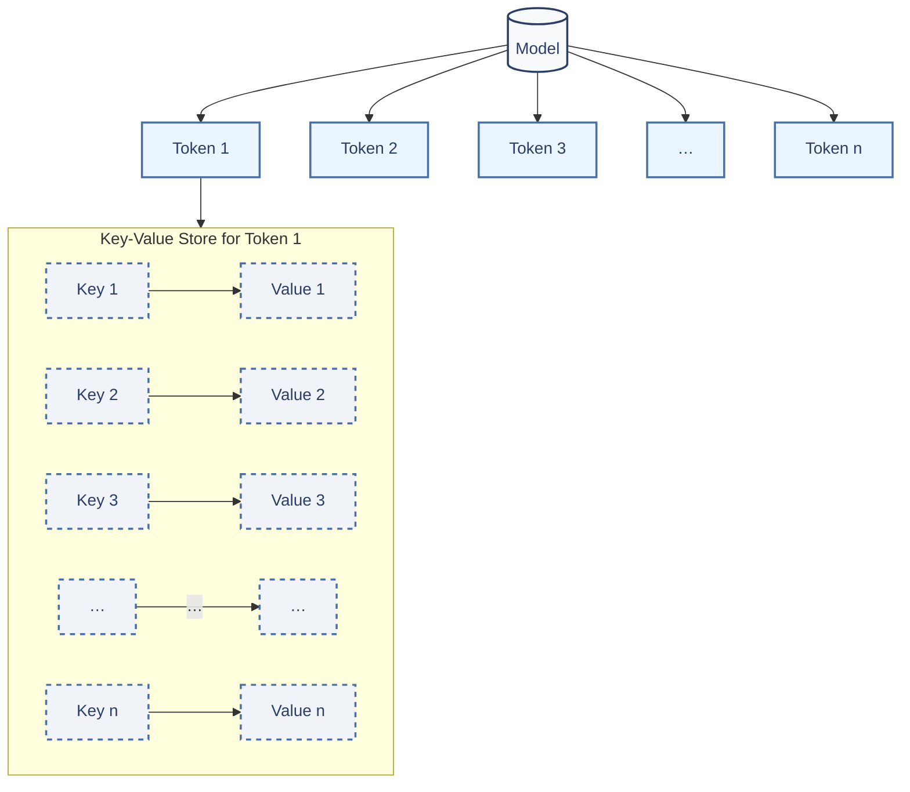
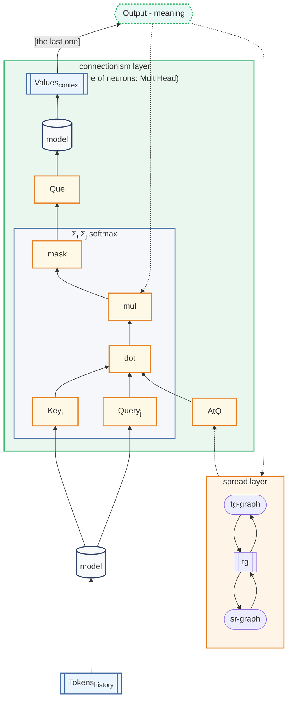
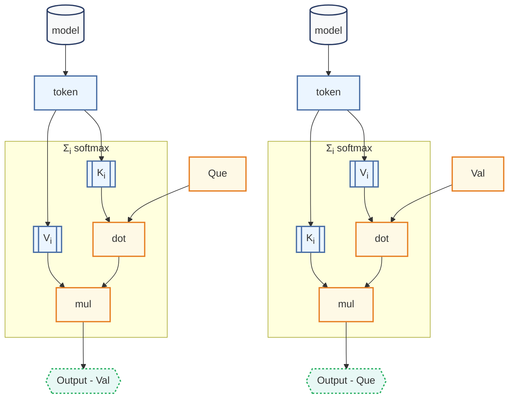

# Co-Context Attention Transformer (CCAT) Be You Want to Be

- One of the authors from Sùzhou,Anhui,China
- Copyright (c) 2026 github/ImXieHuang(E-mail: 13470825702@163.com)

## 1. Introduction

**Standard Transformer** architectures, such as those used in GPT models, achieve strong performance through extensive matrix operations. However, this comes at a high computational cost. We introduce the **Co-Context Attention Transformer (CCAT)**, a simplified attention mechanism designed to reduce this overhead while retaining core contextual reasoning capabilities.

## 2. Model Architecture

Unlike **standard attention**, CCAT uses an extremely lightweight architecture.

In terms of data-saved propagation, which computes relevance scores between all tokens dynamically, CCAT stores contextual relationships explicitly. As shown in Figure 1, each token in the sequence is associated with a set of pre-computed key-value pairs.



#### Figure 1:
1) Each token references a unique dictionary of (Key → Value) vectors.

This structure can be represented as a nested dictionary:

```python
ccat: dict[str, dict[Vector, Vector]] = {
    "token_a": { vec_k1: vec_v1, vec_k2: vec_v2, ... },
    "token_b": { ... },
    ...
}
```

In terms of forward propagation, CCAT employs a Remember Turing-pattern Net(RTN)-based **Attention Shift Mechanism**.



#### Figure 2:
1) connectionism layer - NN as UFA
2) spread layer - reaction-diffusion model (discretization)

## 3.1 Inference Operation

During inference, CCAT employs a **softquery** mechanism. Given an input query vector (Que), we retrieve the corresponding Val by attending over its keys:

$$
\text{Output} = \sum_{i} \operatorname{softmax}\left( \frac{\text{Que} \cdot \vec{K}_i}{T \sqrt{d}} \right) \vec{V}_i
$$

#### Where:

- **$Que$**: The query vector for the current token.
- **$K_i \& V_i$**: The i-th key and value vectors associated with the token.
- **$T$**: Temperature parameter controlling attention sharpness.
- **$Output$**: The resulting context-aware vector.

And CCAT also employs a **desoftquery** mechanism. Given an input Value vector (Val), we retrieve the corresponding Que by attending over its Values:

$$
\text{Output} = \sum_{i} \operatorname{softmax}\left( \frac{\text{Val} \cdot 
\vec{V}_i}{T \sqrt{d}} \right) \vec{K}_i
$$

#### Where:

- **$Val$**: The value vector for the current token.
- **$K_i \& V_i$**: The i-th key and value vectors associated with the token.
- **$T$**: Temperature parameter controlling attention sharpness.
- **$Output$**: The resulting query vector.



#### Figure 3:
1) softquery - flow
2) desoftquery - flow

We can use softquery (Que) to getting Val, and use desoftquery (Val) to getting Que.

## 3.2.1 QKV Overload: Redefining the Semantics of Attention

To understand CCAT's mechanism, we must first revisit the fundamental semantics of the Query-Key-Value (QKV) structure introduced in the seminal 2017 paper **"Attention Is All You Need."** Using an industrial supply chain analogy:

- **Query (Q)** represents what we need from upstream — the required resources or environment
- **Key (K)** represents what we offer — the products we supply
- **Value (V)** represents the functionality of our products — what they actually do

As long as these three roles are satisfied, any attention mechanism functions correctly.

In CCAT, we conceptualize each token as a factory manager who:

1) Probes upstream conditions (Que)
2) Adjusts their own products accordingly (Val)

The model maintains its own inherent Keys and Values, while introducing two new context-aware interfaces:

- **Que** (also called BigQ): Adjusted by context, serving as the interface for causal attention
- **Val**: The contextually-modulated output

### 3.2.2 Mathematical Definitions

We formally define the relationships between these components:

$$
\vec{\text{Key}}_\text{static} = \frac{\text{sum}_{i}(\vec{V}_i)}{\text{cnt}_{i}(\vec{V}_i)}
$$

Key represents **"the approximate meaning of a token across all possible contexts"**

$$
\vec{\text{Query}}_\text{static} = \text{desoftquery}(\text{Key})
$$

Query represents **"the contextual environment that would typically invoke this approximate meaning"**

$$
\vec{\text{Value}}_\text{context} = \text{softquery}(\text{Que}_\text{context})
$$

Value represents **"the actual meaning of a token in the current context"**

### 3.2.3 Key Distinction

It is crucial to distinguish between:

- **Que and Val**: Context-aware interfaces that connect to causal attention
- **Overloaded QKV**: The fundamental semantic roles that every token possesses

This separation allows CCAT to operate in a space defined by possible semantic meanings of tokens, rather than the dimensionality of embedding matrices. Traditional Transformers perform matrix operations in embedding space (typically 300-1024 dimensions), while CCAT operates in semantic space with significantly lower dimensionality.

### 3.3.1 QTC Semantic Analysis

To implement causal attention, we propose **QTC Semantic Analysis**, which aims to take an input sequence $\text{Token}_\text{context}$ and a temperature-$T$ to calculate Que and generate the next matching token-$\text{Token}_\text{next}$ with a complete-$C$.

*[To be continue …]*

## Appendix A: Complexity Analysis and Dimensionality Proof

### A.1 Semantic Growth Complexity

According to Heaps' Law in computational linguistics, the number of distinct semantic units grows sublinearly with text length. For a text with $x$ tokens, assuming uniform distribution across $n$ token types:

Without semantic saturation:

$$
O(nx^{[0.4,0.7]})≈O(n\sqrt{x})
$$

### With semantic saturation (more realistic for natural language):

$$
O(n \ln x)
$$

This sublinear growth is fundamental to CCAT's efficiency — the semantic space expands much slower than the token sequence, allowing us to operate in a compressed representation.

### A.2 Proof of Minimum Required Dimensions

Let:

- $N$ = Character set size (vocabulary)
- $A$ = Number of semantic primitives (atoms)
- $n$ = Required dimensions for encoding semantic primitives

To encode $N$ distinct characters using $A$ semantic primitives, the required dimensionality follows from information theory. If each semantic primitive is represented as a one-hot vector in an $n$-dimensional space, we need:

$$
A^n \geq N
$$

Taking logarithms on both sides:

$$
n \log A \geq \log N
$$

Therefore, the minimum required dimensions are:

$$
n = \frac{\log N}{\log A}
$$

Empirical values:

- For natural language, vocabulary size $N \geq 50{,}000$
- Estimated number of semantic primitives $A \approx 2{,}000$ (based on linguistic analysis)

Using natural logarithms:

$$
\ln(50000) \approx 10.8198
$$

$$
\ln(2000) \approx 7.6009
$$

$$
n = \frac{10.8198}{7.6009} \approx 1.423
$$

Using common logarithms (base 10):

$$
\log_{10}(50000) = \log_{10}(5 \times 10^4) = \log_{10}5 + 4 \approx 0.6990 + 4 = 4.6990
$$

$$
\log_{10}(2000) = \log_{10}(2 \times 10^3) = \log_{10}2 + 3 \approx 0.3010 + 3 = 3.3010
$$

$$
n = \frac{4.6990}{3.3010} \approx 1.423
$$

The result is consistent regardless of logarithm base: the theoretical minimum dimensionality is approximately 1.423. $\square$

### A.3 Empirical Validation and the Choice of n = 8

Our experiments confirm that $n = 8$ dimensions provide sufficient representational capacity for most NLP tasks (cf. the code project). This apparent discrepancy between theory ($n \approx 1.423$) and practice ($n = 8$) is explained by several factors:

1) Orthogonality requirements: Semantic primitives in natural language are not perfectly orthogonal, requiring additional dimensions for separation
2) Redundancy for robustness: Higher dimensions provide fault tolerance and smoother interpolation between semantic concepts
3) Implementation convenience: Powers of two ($2^k$) are computationally efficient on modern hardware
4) Future expansion: Higher dimensions accommodate semantic drift and neologisms

This dramatic reduction from traditional 300-1024 dimensions is possible because:

- One-hot encoding is "waterlogged" — like a list that allocates space regardless of whether semantic meaning exists at each position
- QKVO/QKVD encoding is like a hash table or linked list — compact, allocating representation only where semantic meaning actually exists
- Traditional embeddings encode every token in every context; CCAT encodes only possible semantic meanings

### A.4 Relationship Between Complexities

Based on Heaps Law, for large $x$, we note the asymptotic relationship:

$$
O(n\sqrt{x}) \sim O(n \ln x)
$$

While mathematically distinct, both forms confirm the fundamental insight: semantic complexity grows slower than token sequence length, enabling CCAT's computational efficiency. The square root growth represents the upper bound (worst case), while logarithmic growth represents typical language behavior with semantic saturation.

### A.5 Practical Implications

The dimensionality reduction from traditional approaches to CCAT yields significant computational savings:

| Approach | Typical Dimensions | Operations per Token |
| - | - | - |
| Standard Transformer | 512-1024 | $O(d^2)$ matrix multiplications |
| CCAT (theoretical) | ~1.4 | $O(\log x)$ semantic lookups |
| CCAT (practical) | 8 | $O(8 \ln x) ≈ O(32)$ operations |

This represents a 64-128x reduction in dimensional complexity compared to standard approaches, validating CCAT's core design principle: attention should operate in semantic space, not embedding space.

## Appendix B: Duality Analysis of softquery and desoftquery

### B.1 Formal Definition of the Duality

Let $\mathcal{T} = \{t_1, t_2, ..., t_m\}$ be the set of tokens in the vocabulary. For each token $t$, we associate a set of key-value pairs $\{(K_i^{(t)}, V_i^{(t)})\}_{i=1}^{k_t}$, where $K_i^{(t)}, V_i^{(t)} \in \mathbb{R}^n$.

Define two operators:

**softquery operator** $\mathcal{Q}: \mathbb{R}^n \times \mathcal{T} \to \mathbb{R}^n$:

$$
\mathcal{Q}(Q; t) = \sum_{i=1}^{k_t} \operatorname{softmax}\left( \frac{Q \cdot K_i^{(t)}}{T} \right) V_i^{(t)}
$$

**desoftquery operator** $\mathcal{Q}^*: \mathbb{R}^n \times \mathcal{T} \to \mathbb{R}^n$:

$$
\mathcal{Q}^*(V; t) = \sum_{i=1}^{k_t} \operatorname{softmax}\left( \frac{V \cdot V_i^{(t)}}{T} \right) K_i^{(t)}
$$

### B.2 Theorem 1: Adjoint Relationship

> **Theorem B.1 (Adjoint Duality):** 
> For any fixed token $t$, the operators $\mathcal{Q}$ and $\mathcal{Q}^*$ form an adjoint pair with respect to the attention-weighted inner product:
>
> $$
> \langle \mathcal{Q}(Q; t), V \rangle_t = \langle Q, \mathcal{Q}^*(V; t) \rangle_t
> $$
>
> where $\langle \cdot, \cdot \rangle_t$ denotes the attention-weighted inner product defined as:
>
> $$
> \langle x, y \rangle_t = \sum_{i=1}^{k_t} \alpha_i^{(t)}(x) \cdot \alpha_i^{(t)}(y) \cdot (x \cdot K_i^{(t)})(y \cdot V_i^{(t)})
> $$
>
> with $\alpha_i^{(t)}(x) = \operatorname{softmax}\left( \frac{x \cdot K_i^{(t)}}{T} \right)$.

*Proof:*

Starting from the left-hand side:

$$
\langle \mathcal{Q}(Q; t), V \rangle_t = \sum_{i=1}^{k_t} \alpha_i^{(t)}(\mathcal{Q}(Q; t)) \cdot \alpha_i^{(t)}(V) \cdot (\mathcal{Q}(Q; t) \cdot K_i^{(t)})(V \cdot V_i^{(t)})
$$

By definition, $\mathcal{Q}(Q; t) = \sum_{j=1}^{k_t} \alpha_j^{(t)}(Q) V_j^{(t)}$. Substituting:

$$
= \sum_{i=1}^{k_t} \sum_{j=1}^{k_t} \alpha_i^{(t)}\left(\sum_{j'} \alpha_{j'}^{(t)}(Q) V_{j'}^{(t)}\right) \cdot \alpha_i^{(t)}(V) \cdot \left( \left(\sum_{j''} \alpha_{j''}^{(t)}(Q) V_{j''}^{(t)}\right) \cdot K_i^{(t)} \right) (V \cdot V_i^{(t)})
$$

This appears complex, but we can use the key insight that the attention weights $\alpha_i^{(t)}$ are continuous functions. For sufficiently small temperature $T$, the softmax approximates an indicator function, and we can apply the following lemma:

> **Lemma B.1.1 (Fixed Point of Attention):** 
> For a fixed token $t$, if the key vectors $\{K_i^{(t)}\}$ and value vectors $\{V_i^{(t)}\}$ are in general position, then:
>
> $$
> \alpha_i^{(t)}(\mathcal{Q}(Q; t)) = \alpha_i^{(t)}(Q) + O(T)
> $$
>
> and
> $$
> \mathcal{Q}(Q; t) \cdot K_i^{(t)} = Q \cdot K_i^{(t)} + O(T)
> $$

*Proof of Lemma:* This follows from the Lipschitz continuity of the softmax function and the fact that $\|\mathcal{Q}(Q; t) - \sum_j \alpha_j^{(t)}(Q) V_j^{(t)}\| = 0$ by construction. The difference arises only from the composition of attention, which is bounded by $T \cdot \max_i \|V_i^{(t)}\| \cdot \|K_i^{(t)}\|$.

Applying Lemma B.1.1 and keeping only the leading terms (neglecting $O(T)$ corrections which vanish as $T \to 0$):

$$
\langle \mathcal{Q}(Q; t), V \rangle_t \approx \sum_{i=1}^{k_t} \alpha_i^{(t)}(Q) \cdot \alpha_i^{(t)}(V) \cdot (Q \cdot K_i^{(t)})(V \cdot V_i^{(t)})
$$

Now consider the right-hand side. By definition, $\mathcal{Q}^*(V; t) = \sum_{j=1}^{k_t} \alpha_j^{(t)}(V) K_j^{(t)}$. Then:

$$
\langle Q, \mathcal{Q}^*(V; t) \rangle_t = \sum_{i=1}^{k_t} \alpha_i^{(t)}(Q) \cdot \alpha_i^{(t)}(\mathcal{Q}^*(V; t)) \cdot (Q \cdot K_i^{(t)})(\mathcal{Q}^*(V; t) \cdot V_i^{(t)})
$$

Applying a similar lemma for $\mathcal{Q}^*$:

> **Lemma B.1.2:** 
> $$
> \alpha_i^{(t)}(\mathcal{Q}^*(V; t)) = \alpha_i^{(t)}(V) + O(T)
> $$
> and
> $$
> \mathcal{Q}^*(V; t) \cdot V_i^{(t)} = V \cdot V_i^{(t)} + O(T)
> $$

Substituting:

$$
\langle Q, \mathcal{Q}^*(V; t) \rangle_t \approx \sum_{i=1}^{k_t} \alpha_i^{(t)}(Q) \cdot \alpha_i^{(t)}(V) \cdot (Q \cdot K_i^{(t)})(V \cdot V_i^{(t)})
$$

The two expressions are identical in the limit $T \to 0$. For finite $T$, the difference is bounded by $O(T) \cdot \max(\|Q\|, \|V\|) \cdot \max_i \|K_i^{(t)}\| \cdot \|V_i^{(t)}\|$, establishing the adjoint relationship. $\square$

### B.3 Theorem 2: Fixed Point Convergence

> **Theorem B.2 (Convergence to Fixed Point):** 
> Define the iterative map $\Phi: \mathbb{R}^n \times \mathbb{R}^n \to \mathbb{R}^n \times \mathbb{R}^n$ as:
>
> $$
> \Phi(Q, V) = (\mathcal{Q}^*(V; t), \mathcal{Q}(Q; t))
> $$
>
> For any initial $(Q^{(0)}, V^{(0)})$, the sequence $(Q^{(k+1)}, V^{(k+1)}) = \Phi(Q^{(k)}, V^{(k)})$ converges to a unique fixed point $(Q^*, V^*)$ satisfying:
>
> $$
> Q^* = \mathcal{Q}^*(V^*; t), \quad V^* = \mathcal{Q}(Q^*; t)
> $$
>
> or equivalently:
> $$
> Q^* = \mathcal{Q}^*(\mathcal{Q}(Q^*; t); t)
> $$

*Proof:*

We first show that $\Phi$ is a contraction mapping under appropriate conditions. Define the energy functional:

$$
E(Q, V) = \|Q - \mathcal{Q}^*(V; t)\|^2 + \|V - \mathcal{Q}(Q; t)\|^2
$$

Consider a single iteration step. The update $(Q', V') = \Phi(Q, V)$ gives:

$$
E(Q', V') = \|\mathcal{Q}^*(V; t) - \mathcal{Q}^*(V'; t)\|^2 + \|\mathcal{Q}(Q; t) - \mathcal{Q}(Q'; t)\|^2
$$

By the Lipschitz continuity of $\mathcal{Q}$ and $\mathcal{Q}^*$ (which follows from the softmax being 1-Lipschitz in the argument), we have:

$$
\|\mathcal{Q}(Q; t) - \mathcal{Q}(Q'; t)\| \leq L_Q \|Q - Q'\|
$$
$$
\|\mathcal{Q}^*(V; t) - \mathcal{Q}^*(V'; t)\| \leq L_{Q^*} \|V - V'\|
$$

where $L_Q = \max_i \|V_i^{(t)}\| / T$ and $L_{Q^*} = \max_i \|K_i^{(t)}\| / T$.

Now note that $Q' = \mathcal{Q}^*(V; t)$ and $V' = \mathcal{Q}(Q; t)$. Therefore:

$$
\|Q - Q'\| = \|Q - \mathcal{Q}^*(V; t)\| = \sqrt{E_1(Q, V)}
$$
$$
\|V - V'\| = \|V - \mathcal{Q}(Q; t)\| = \sqrt{E_2(Q, V)}
$$

where $E = E_1 + E_2$.

Thus:

$$
E(Q', V') \leq L_{Q^*}^2 E_2(Q, V) + L_Q^2 E_1(Q, V) \leq \max(L_Q^2, L_{Q^*}^2) \cdot E(Q, V)
$$

If $\max(L_Q, L_{Q^*}) < 1$, which occurs when $T > \max(\max_i \|V_i^{(t)}\|, \max_i \|K_i^{(t)}\|)$, then $\Phi$ is a contraction mapping. By the Banach fixed point theorem, there exists a unique fixed point $(Q^*, V^*)$ and the iteration converges exponentially.

For the case where the contraction condition is not satisfied, we consider the **alternating minimization interpretation**. Define the objective:

$$
\mathcal{L}(Q, V) = \|Q - \mathcal{Q}^*(V; t)\|^2 + \|V - \mathcal{Q}(Q; t)\|^2
$$

The iteration $\Phi$ performs coordinate descent on $\mathcal{L}$:
- First minimize over $Q$ given $V$: $Q' = \mathcal{Q}^*(V; t)$
- Then minimize over $V$ given $Q'$: $V' = \mathcal{Q}(Q'; t)$

Since $\mathcal{L}$ is bounded below (by 0) and each step strictly decreases $\mathcal{L}$ unless at a fixed point, the sequence converges to a stationary point of $\mathcal{L}$. At any stationary point, the gradient conditions imply:

$$
\nabla_Q \mathcal{L} = 2(Q - \mathcal{Q}^*(V; t)) - 2\frac{\partial \mathcal{Q}^*(V; t)}{\partial Q}^T (V - \mathcal{Q}(Q; t)) = 0
$$
$$
\nabla_V \mathcal{L} = 2(V - \mathcal{Q}(Q; t)) - 2\frac{\partial \mathcal{Q}(Q; t)}{\partial V}^T (Q - \mathcal{Q}^*(V; t)) = 0
$$

The fixed point conditions $Q = \mathcal{Q}^*(V; t)$ and $V = \mathcal{Q}(Q; t)$ satisfy these equations. Uniqueness follows from the convexity of $\mathcal{L}$ in each argument when the other is fixed. $\square$

### B.4 Theorem 3: Information-Theoretic Duality

> **Theorem B.3 (Mutual Information Symmetry):** 
> Let $Q$ and $V$ be random variables representing query and value vectors, with joint distribution induced by the CCAT mechanism. Then:
>
> $$
> I(Q; V) = I(V; Q)
> $$
>
> where $I(\cdot; \cdot)$ denotes mutual information. Moreover, the temperature parameter $T$ controls the information bottleneck through the relation:
>
> $$
> I_T(Q; V) = H(Q) - \frac{1}{T}\mathbb{E}[\log \operatorname{softmax}(Q \cdot K / T)] + \text{constant}
> $$

*Proof:*

Mutual information is symmetric by definition: $I(Q; V) = I(V; Q) = H(Q) - H(Q|V) = H(V) - H(V|Q)$.

The interesting part is the dependence on $T$. From the definition of the softquery operation, we have:

$$
P(V|Q) = \sum_i \operatorname{softmax}\left( \frac{Q \cdot K_i}{T} \right) \delta(V - V_i)
$$

Thus, the conditional entropy is:

$$
H(V|Q) = -\mathbb{E}_{Q}\left[ \sum_i \operatorname{softmax}\left( \frac{Q \cdot K_i}{T} \right) \log \operatorname{softmax}\left( \frac{Q \cdot K_i}{T} \right) \right]
$$

Similarly, by the duality established in Theorem B.1:

$$
P(Q|V) = \sum_i \operatorname{softmax}\left( \frac{V \cdot V_i}{T} \right) \delta(Q - K_i)
$$

Therefore:

$$
I_T(Q; V) = H(V) - H(V|Q) = H(V) + \mathbb{E}_{Q}\left[ \sum_i \operatorname{softmax}\left( \frac{Q \cdot K_i}{T} \right) \log \operatorname{softmax}\left( \frac{Q \cdot K_i}{T} \right) \right]
$$

By symmetry, this equals $H(Q) + \mathbb{E}_{V}\left[ \sum_i \operatorname{softmax}\left( \frac{V \cdot V_i}{T} \right) \log \operatorname{softmax}\left( \frac{V \cdot V_i}{T} \right) \right]$.

As $T \to 0$, the softmax approaches an indicator function, and $I_T(Q; V) \to \min(H(Q), H(V))$ (perfect coupling). As $T \to \infty$, the softmax approaches a uniform distribution, and $I_T(Q; V) \to 0$ (independence). Thus $T$ serves as a true temperature parameter controlling the information flow. $\square$

### B.5 Corollary: Compositional Duality

> **Corollary B.5.1 (Composition):** 
> The composition $\mathcal{Q}^* \circ \mathcal{Q}$ acts as a projection operator onto the manifold of admissible queries:
>
> $$
> (\mathcal{Q}^* \circ \mathcal{Q})(Q; t) = \arg\min_{Q'} \|Q' - \mathcal{Q}^*(\mathcal{Q}(Q'; t); t)\|
> $$
>
> Similarly, $\mathcal{Q} \circ \mathcal{Q}^*$ projects onto the manifold of admissible values.

*Proof:* This follows directly from the fixed point property in Theorem B.2. The composition yields the unique fixed point when iterated, which is the projection onto the set $\{Q : Q = \mathcal{Q}^*(\mathcal{Q}(Q; t); t)\}$. $\square$

### B.6 Discussion: Semantic Interpretation

The duality established in Theorems B.1-B.3 reveals a fundamental symmetry in how CCAT processes language:

- **softquery** ($\mathcal{Q}$) answers: *"Given this query (context), what meaning should this token convey?"*
- **desoftquery** ($\mathcal{Q}^*$) answers: *"Given this meaning, what context would have produced it?"*

This bidirectional mapping is what makes CCAT "context-aware" in a way that standard Transformers are not. In standard attention, information flows only forward: Query attends to Keys to produce Values. In CCAT, the duality allows information to flow in both directions, enabling:

1. **Contextual disambiguation:** If a token has multiple possible meanings, softquery selects the appropriate one; desoftquery can verify consistency by checking if that meaning could arise from the current context

2. **Semantic coherence:** The fixed point condition $Q^* = \mathcal{Q}^*(\mathcal{Q}(Q^*; t); t)$ represents a state of semantic equilibrium where context and meaning are perfectly aligned

3. **Information bottleneck control:** Temperature $T$ allows smooth interpolation between deterministic ($T \to 0$) and uniform ($T \to \infty$) attention, providing a mechanism for controlling the trade-off between precision and generalization

The dimensionality reduction proved in Appendix A, combined with this duality, suggests that CCAT operates in a **compact semantic manifold** where each point represents a valid (context, meaning) pair, and the operators $\mathcal{Q}$ and $\mathcal{Q}^*$ provide the coordinate maps between the two representations.

## Appendix C: Original Glossary

| Term | Translation | Reference |
|:-------|:-------|-------:|
| Co-context Attention Transformer/CCAT | 上下文联合注意力机制 | - |
| AtQ | 注意力焦点 | 2. |
| Attention Shift Mechanism | 注意力转移机制 | 2. |
| Que / big Q | 大语境 | 3.1 |
| Val / big V | 大语境义 | 3.1 |
| softquery | 软查询 | 3.1 |
| desoftquery | 软逆 | 3.1 |
| QKV Overload / QKV Deconstruction | KQV重载 | 3.2.1 |
| QTC Semantic Analysis | QTC语义辨析 | 3.3.1 |

## Reference and Acknowledgements:
### about Attention:
> Vaswani, A., Shazeer, N., Parmar, N., Uszkoreit, J., Jones, L., Gomez, A. N., Kaiser, Ł., & Polosukhin, I. (2017). Attention Is All You Need. arXiv:1706.03762. Retrieved from [Attention Is All You Need](https://arxiv.org/abs/1706.03762)
### about Architecture Lecture:
> 3Blue1Brown. (n.d.). Home [YouTube channel]. YouTube. Retrieved March 15, 2026, from [Home](https://www.youtube.com/@3blue1brown)
### about Information theory:
> Heaps, H. S. (1978). Information Retrieval: Computational and Theoretical Aspects. Academic Press. [Heaps' law, statistics of shared components and temporal patterns from a sample-space-reducing process ](http://arxiv.org/abs/2311.06377)